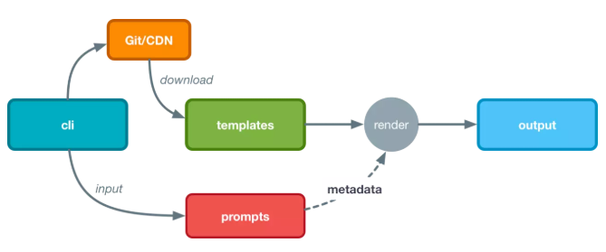

# tapp-cli

a simple template-based scaffolding tool to help create app

## Todo List

- [x] create template 
- [x] add template 
- [x] remote template download and transform
- [ ] middleware
- [ ] plugins
- [ ] testing

## Motivation
The reason is that I think I need a scaffolding tool that is more suitable for my personal productivity

### How It Works

> P.S. The picture is from the Internet

### How To Use
```
git clone xxx(download this respository) 
npm run start
```
or
```
npm install tapp-cli
tapp-cli create
```


### Options
create template
```
tapp-cli create
```
add template
```
tapp-cli add
```

